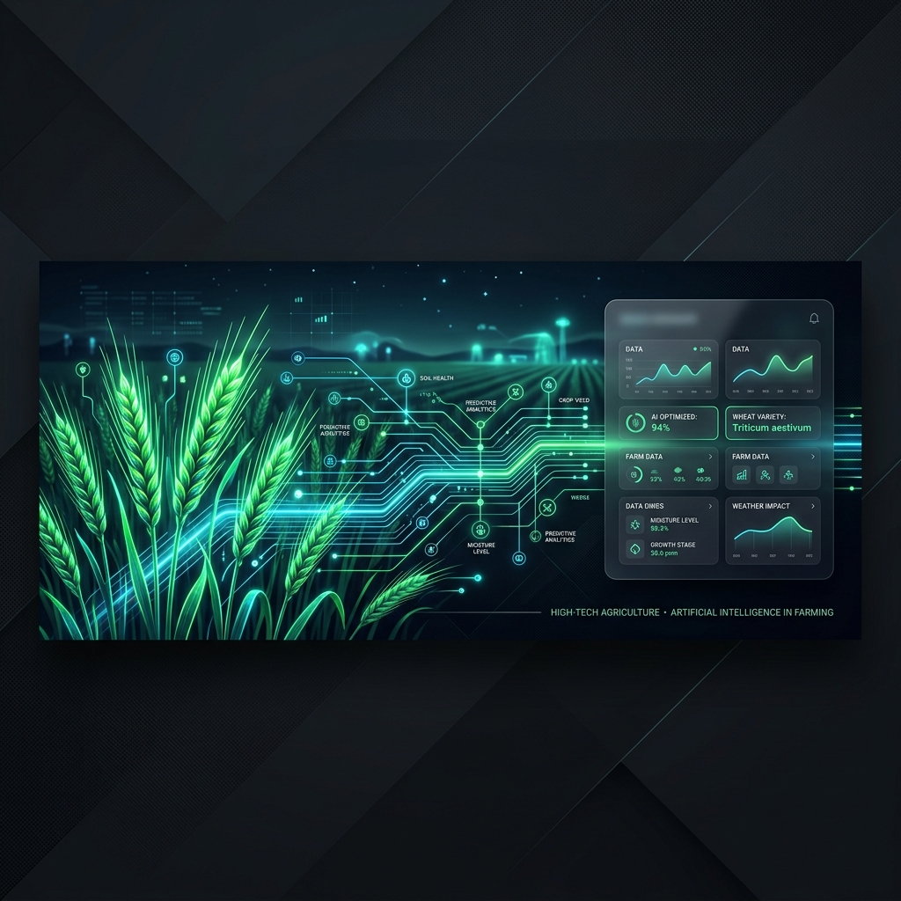

<div align="center">
  
  <h1>🌾 MandiIntel Dashboard</h1>
  <p><strong>Next-Generation AI-Powered Agricultural Intelligence for Indian Farmers</strong></p>
</div>

<br>



## 📖 Overview
MandiIntel is a premium, glassmorphism-themed agricultural analytics dashboard specifically engineered to empower Indian farmers. It dynamically visualizes nationwide `Agmarknet` crop pricing data, predicts 7-day market trajectories utilizing mathematical algorithms, and injects **deep artificial intelligence** from OpenRouter LLMs to provide real-time, actionable selling strategies in both **English and native Hindi**.

---

## ✨ Features
- **🌐 Dual-Language Support (English/Hindi):** Seamlessly shifts the entire UI, dynamic API responses, and AI prompts into native Hindi on the fly.
- **🧠 OpenRouter AI Integration:** Dynamically interfaces with state-of-the-art LLMs (`Gemini 2.0`, `Llama 3.1`, `Mistral 7B`) to provide concise, farmer-focused bullet points on whether to hold or sell.
- **📊 Trading-Grade Data Visualization:** Leverages robust Chart.js implementations featuring dynamic zero-bound slicing to drastically highlight microscopic daily price variations.
- **📱 Fully Responsive Drawer Layout:** Intelligent mobile-first breakpoints flawlessly snap the platform into an off-canvas hamburger drawer orientation on smartphones.
- **🧮 Profit Calculator:** A dynamic side-panel calculator extracting real-time APMC data to model post-transportation profit limits.
- **⚡️ Dummy Data Generator Engine:** A highly robust fallback simulator ensuring the dashboard renders flawlessly (with volatility parameters) even in low-bandwidth zones when APIs time out.

---

## 🔌 API Integrations & Core Systems

### 1. Indian Government Data Server (Data.gov.in)
MandiIntel retrieves live national market data via the official `Agmarknet` Open Data API endpoints.
- **Role:** Fetches daily APMC (Agriculture Produce Market Committee) selling prices parsing deep parameters like Crop IDs and District nodes.
- **Resilience:** If network barriers occur, a background `generate30DayDummyData()` algorithm immediately kicks in to guarantee UI stability. 
- **Auto-Translation Mechanism:** The raw API outputs structural English strings (`"Tomato"`, `"Azadpur"`). A dedicated localized runtime dictionary violently intercepts API packets during the UI hydration phase to print flawless Hindi vectors (`"टमाटर"`, `"आजादपुर"`).

### 2. OpenRouter Artificial Intelligence Network
MandiIntel bypasses rigid heuristic math loops by natively querying top-tier NLP models securely via OpenRouter.
- **Mechanics:** 30 consecutive days of statistical pricing curves are systematically formatted and bundled as deep system prompts.
- **Instruction Pipeline:** The AI strictly limits outputs to concise 2-sentence directives analyzing the overall agricultural curve.
- **Localization Constraint:** If the user toggles the local `Hindi` switch, the system overrides external prompt headers demanding the offshore models reply `IN HINDI language strictly`.

---

## 🚀 Local Deployment

1. **Clone the matrix:**
   ```bash
   git clone https://github.com/h4rsh740/mandi-intel-dashboard.git
   cd mandi-intel-dashboard
   ```
2. **Launch a local server:**
   Due to ES6 Modules and Fetch CORS policies, you must serve the directory spanning your API calls.
   ```bash
   python3 -m http.server 8000
   ```
3. **Initialize the UI Hub:**
   Open your browser and navigate to:
   `http://localhost:8000/`

---

<div align="center">
  <p>Built natively with Vanilla JavaScript, Modern CSS3, HTML5, and Chart.js.</p>
  <i>Empowering agriculture with algorithmic clarity.</i>
</div>
